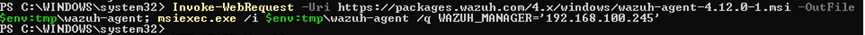
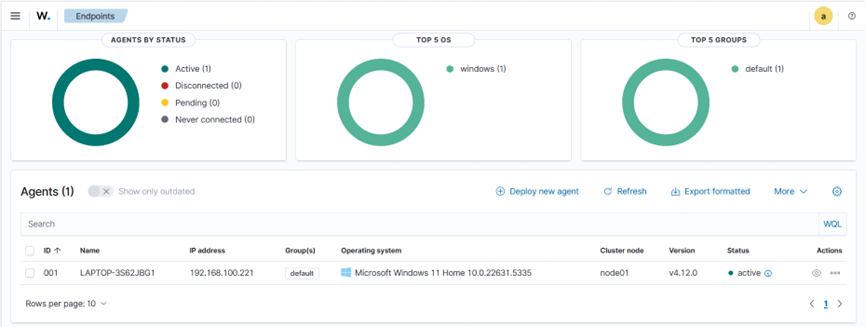
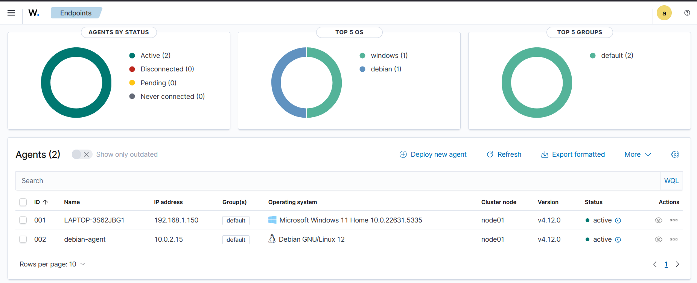

# Agent Deployment and Monitoring

## Objective

Deploy Wazuh agents on Windows and Linux systems, verify successful enrollment, and begin collecting security events for monitoring and analysis.

## Software Used

| Software | Purpose |
|----------|---------|
| Wazuh Dashboard | Generated agent enrollment commands and monitored agent status. |
| Windows Virtual Machine | Hosted the Windows Wazuh agent. |
| Debian Virtual Machine | Hosted the Linux Wazuh agent. |
| Wazuh Agent | Collected system events and forwarded them to the Wazuh Manager. |

## Implementation

The agent deployment process included enrolling both Windows and Linux systems into the Wazuh platform and confirming successful communication with the Manager.

The following tasks were completed:

- Generated the Windows agent enrollment command from the Wazuh Dashboard.
- Installed and registered the Wazuh agent on a Windows virtual machine.
- Generated the Linux agent enrollment command.
- Installed and registered the Wazuh agent on a Debian virtual machine.
- Verified that both agents successfully connected to the Wazuh Manager.
- Confirmed that both agents appeared as **Active** in the Wazuh Dashboard.

## Verification

The deployment was verified by confirming successful agent enrollment and communication with the Wazuh Manager.

The following checks were performed:

- Verified that both Windows and Linux agents appeared as **Active** in the Wazuh Dashboard.
- Confirmed that the enrolled agents were successfully communicating with the Wazuh Manager.
- Generated basic system activity on both operating systems and verified that security events were received in the Wazuh Dashboard.

## Evidence

### Windows Agent Enrollment Command

The following screenshot shows the enrollment command generated from the Wazuh Dashboard before installing the Windows agent.

### Windows Agent Successfully Installed

The following screenshot confirms that the Windows agent was successfully installed and registered with the Wazuh Manager.

### Linux Agent Installation

The following screenshot shows the successful installation of the Wazuh agent on a Debian virtual machine.

## Lessons Learned

- Learned how Wazuh agents are enrolled and connected to the Wazuh Manager.
- Gained practical experience deploying Wazuh agents on both Windows and Debian systems.
- Understood how agent activity is reflected in the Wazuh Dashboard through real-time security events.
