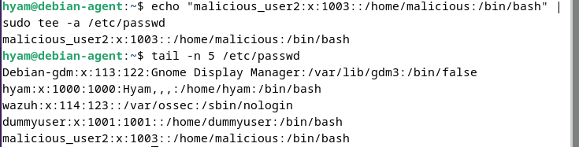
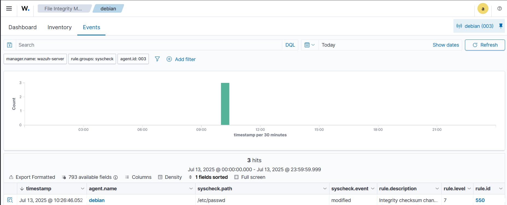
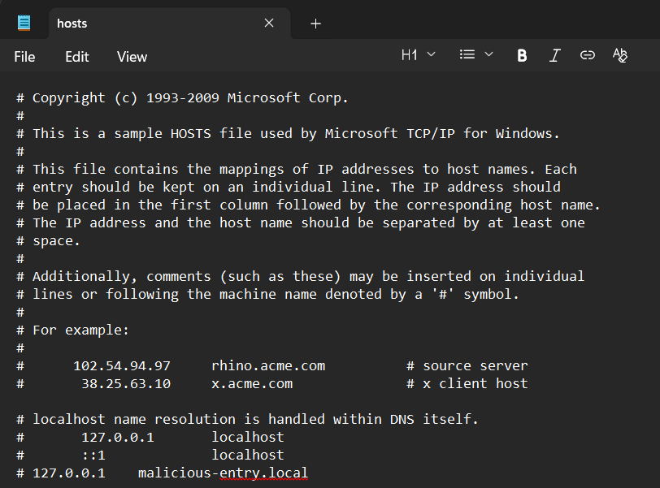
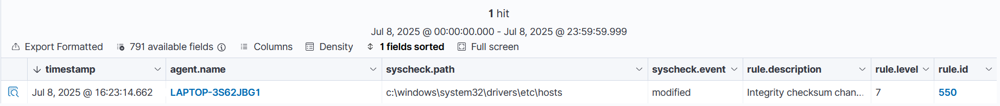

# File Integrity Monitoring (FIM)

## Objective

Validate Wazuh's File Integrity Monitoring capability by modifying critical system files on Linux and Windows systems and verifying that integrity alerts were generated successfully.

## Software Used

| Software | Purpose |
|----------|---------|
| Wazuh Dashboard | Monitored File Integrity Monitoring alerts. |
| Debian Virtual Machine | Simulated file modifications on Linux. |
| Windows Virtual Machine | Simulated file modifications on Windows. |
| Wazuh Syscheck Module | Detected file integrity changes in real time. |

## Implementation

File Integrity Monitoring (FIM) was tested by modifying monitored system files on both Linux and Windows systems.

The following tasks were completed:

- Modified the `/etc/passwd` file on the Debian virtual machine.
- Verified that the Syscheck module detected the file modification.
- Modified the Windows `hosts` file to simulate an unauthorized change.
- Verified that Wazuh detected the file modification and generated integrity alerts.
- Reviewed the generated alerts in the Wazuh Dashboard.

## Verification

The File Integrity Monitoring functionality was verified by confirming that Wazuh generated integrity alerts after monitored files were modified.

The following checks were performed:

- Confirmed that modifications to `/etc/passwd` on the Debian virtual machine generated a File Integrity Monitoring alert.
- Confirmed that modifications to the Windows `hosts` file generated a File Integrity Monitoring alert.
- Verified that both alerts were detected by the **Syscheck** module.
- Verified that both events generated **Rule ID 550 (Integrity checksum changed)**.
- Confirmed that file modifications were detected during integrity monitoring and displayed in the Wazuh Dashboard.

## Evidence

### Linux FIM Modification – /etc/passwd

The following screenshot shows the modification made to the `/etc/passwd` file to trigger a File Integrity Monitoring event.

### FIM Alert – Integrity Checksum Change (Linux)

The following screenshot shows the generated **Rule ID 550** alert after modifying the monitored file.

### Windows FIM Modification – Hosts File

The following screenshot shows the modification made to the Windows `hosts` file to simulate an integrity change.

### FIM Alert – Integrity Checksum Change (Windows)

The following screenshot shows the integrity alert generated after modifying the monitored Windows file.

## Lessons Learned

- Gained practical experience testing File Integrity Monitoring on both Linux and Windows systems.
- Learned how the Syscheck module detects unauthorized file modifications and generates integrity alerts.
- Improved the ability to verify file integrity events using the Wazuh Dashboard.
