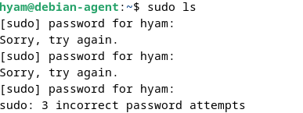
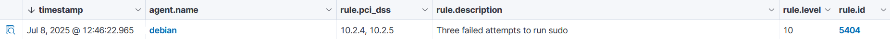
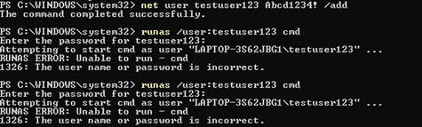
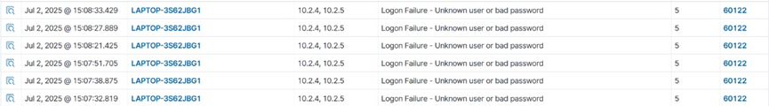

# Log Data Collection and Basic Alert Analysis

## Objective

Collect and analyze security-related log events from Linux and Windows agents and verify that Wazuh detects authentication failures and generates corresponding security alerts.

## Software Used

| Software                | Purpose                                                      |
| ----------------------- | ------------------------------------------------------------ |
| Wazuh Dashboard         | Reviewed collected events and generated security alerts.     |
| Debian Virtual Machine  | Generated and monitored failed sudo authentication attempts. |
| Windows Virtual Machine | Generated and monitored failed login attempts.               |
| Wazuh Log Collector     | Collected and analyzed Linux system log events.              |
| EventChannel            | Collected Windows security log events.                       |

## Implementation

Log data collection and basic alert analysis were performed on both Debian Linux and Windows systems to observe how Wazuh detects authentication-related security events.

### Linux – Failed Sudo Authentication

A user on the Debian system attempted to execute a privileged command using `sudo` but entered an incorrect password three times.

Wazuh collected the related system log events through the Journald input source. The events were processed by the sudo decoder and matched **Rule ID 5404**, which identifies multiple failed sudo authentication attempts.

The activity involved user `hyam` attempting to execute the `ls` command as `root`.

The resulting alert was classified under the `syslog > sudo` group.

### Windows – Failed Login Attempt

A new Windows user named `testuser123` was created on the Windows agent. Several login attempts were intentionally performed using incorrect credentials to simulate an unauthorized access attempt.

Wazuh collected the failed logon events through **EventChannel** and generated security alerts under the `windows_security > authentication_failed` group.

The detected event was associated with **Rule ID 60122**.

## Verification

The generated alerts were reviewed in the Wazuh Dashboard to verify that the simulated authentication failures were successfully collected and detected.

The following results were confirmed:

* Linux: Multiple failed sudo attempts generated **Rule ID 5404**.
* Windows: Failed login attempts generated **Rule ID 60122**.
* Linux events were collected through the **Journald** input source.
* Windows security events were collected through **EventChannel**.
* The alerts were displayed in their corresponding alert groups in the Wazuh Dashboard.

## Evidence

### Linux – Failed Sudo Attempt

A Debian user entered an incorrect password multiple times while attempting to use `sudo`, generating a failed authentication event.

### Linux – Sudo Authentication Failure Alert

Wazuh detected the multiple failed sudo attempts and generated **Rule ID 5404** under the `syslog > sudo` alert group.

### Windows – Failed Login Attempt

The Windows user `testuser123` performed multiple login attempts using invalid credentials to simulate an unauthorized access attempt.

### Windows – Authentication Failure Alert

Wazuh detected the failed logon events through EventChannel and generated alerts under the `windows_security > authentication_failed` group.

## Lessons Learned

* Gained practical experience collecting and analyzing authentication-related security events from both Linux and Windows systems.
* Learned how Wazuh uses different log collection mechanisms to monitor events across operating systems.
* Improved the ability to interpret Wazuh alerts using rule IDs, alert groups, and event sources.
* Learned how repeated authentication failures can provide indicators of potential unauthorized access or privilege escalation attempts.

