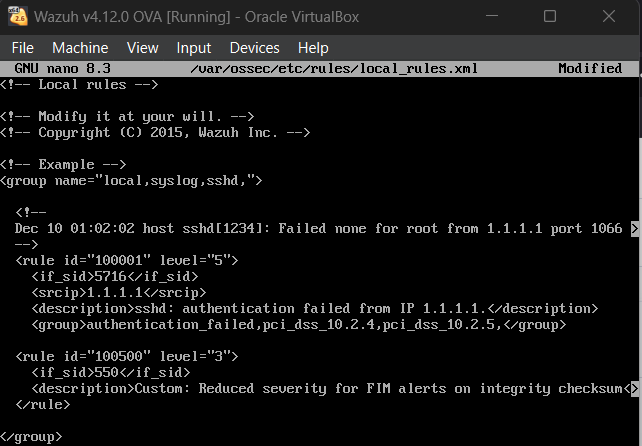

# Basic Rule Tuning

## Objective

Reduce alert noise by adjusting the severity level of a frequently triggered SSH authentication rule while keeping higher-priority security alerts visible.

## Software Used

| Software          | Purpose                                                 |
| ----------------- | ------------------------------------------------------- |
| Wazuh Dashboard   | Reviewed alerts and verified the updated rule severity. |
| Wazuh Manager     | Applied and processed the customized rule.              |
| `local_rules.xml` | Used to locally customize the alert severity.           |

## Implementation

A frequently triggered SSH authentication rule was identified as a source of alert noise.

The rule was customized locally to reduce its severity level while continuing to detect the associated authentication failure events.

The following tasks were completed:

* Identified **Rule ID 100001** as the rule selected for tuning.
* Reviewed the rule associated with repeated SSH authentication failures from IP address `1.1.1.1`.
* Modified the local rule in `local_rules.xml`.
* Changed the rule severity level to **5**.
* Restarted the Wazuh Manager to apply the updated rule configuration.

### Rule Details

| Item               | Details                    |
| ------------------ | -------------------------- |
| Rule ID            | `100001`                   |
| Event              | SSH authentication failure |
| Source IP          | `1.1.1.1`                  |
| Updated Severity   | `5`                        |
| Configuration File | `local_rules.xml`          |

## Verification

After restarting the Wazuh Manager, new alerts matching the customized rule were reviewed in the Wazuh Dashboard.

The updated alerts appeared with **severity level 5**, confirming that the local rule modification was successfully applied.

The tuning reduced the volume of lower-priority alert noise while allowing higher-level alerts to remain visible.

## Evidence

### Custom Rule Adjustment – SSH Authentication Failures

The local rule was customized to lower the severity of repeated SSH authentication failure alerts to **level 5**. After restarting the Wazuh Manager, the updated severity was reflected in the generated alert.

## Lessons Learned

* Gained practical experience modifying Wazuh detection rules using `local_rules.xml`.
* Learned how rule severity can be adjusted to reduce unnecessary alert noise.
* Learned that the Wazuh Manager must be restarted for rule configuration changes to take effect.
* Improved understanding of balancing alert visibility with the need to focus on higher-priority security events.

