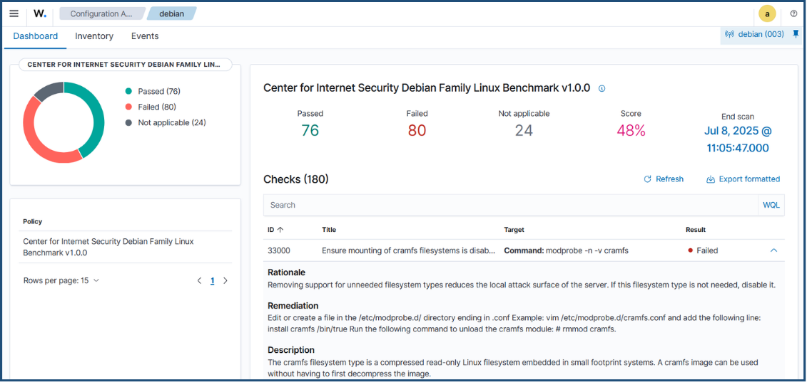
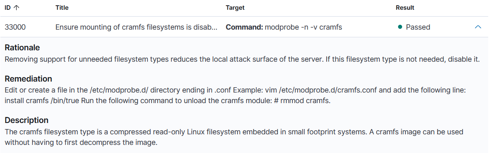

# Security Configuration Assessment (SCA)

## Objective

Evaluate system security configurations using Wazuh Security Configuration Assessment (SCA), remediate non-compliant settings, and verify compliance after applying security recommendations.

## Software Used

| Software | Purpose |
|----------|---------|
| Wazuh Dashboard | Wazuh Dashboard | Used to monitor SCA results and compliance status. |
| Debian Virtual Machine | Tested Linux security configuration compliance. |
| Windows Virtual Machine | Tested Windows security policy compliance. |
| Wazuh SCA Module | Evaluated security configurations against predefined policies. |

## Implementation

Security Configuration Assessment (SCA) was performed on both Linux and Windows systems to identify security misconfigurations and verify compliance after remediation.

The following tasks were completed:

- Evaluated the Linux system against the Wazuh SCA policy.
- Disabled the `cramfs` filesystem module to reduce the attack surface.
- Re-ran the SCA assessment after applying the remediation.
- Evaluated the Windows password history policy.
- Updated the **Enforce password history** policy to require a minimum of 24 previous passwords.

## Verification

The Security Configuration Assessment results were verified by confirming that remediation actions changed the compliance status from **Failed** to **Passed**.

The following checks were performed:

- Verified that **Rule ID 33000** changed to **Passed** after disabling the `cramfs` filesystem module.
- Verified that **Rule ID 26000** changed to **Passed** after updating the Windows password history policy.
- Confirmed that Wazuh re-evaluated both systems and reported the updated compliance status in the SCA module.

## Commands Used

Disable the `cramfs` filesystem module:

```bash
echo "install cramfs /bin/true" | sudo tee /etc/modprobe.d/cramfs.conf
sudo rmmod cramfs
```

## Evidence

### Linux SCA – Initial Compliance Failure

The initial SCA assessment identified the `cramfs` configuration as non-compliant under **Rule ID 33000**.



### Linux SCA – Compliance Passed After Remediation

After disabling the `cramfs` filesystem module, Wazuh re-evaluated the configuration and reported **Rule ID 33000** as **Passed**.



### Windows SCA – Initial Compliance Failure

The initial SCA assessment identified the **Enforce password history** setting as non-compliant under **Rule ID 26000**.


### Windows SCA – Compliance Passed After Remediation

After updating the password history policy to the recommended value, Wazuh re-evaluated the configuration and reported **Rule ID 26000** as **Passed**.


