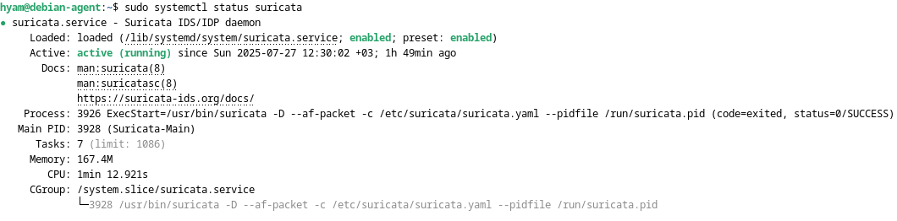
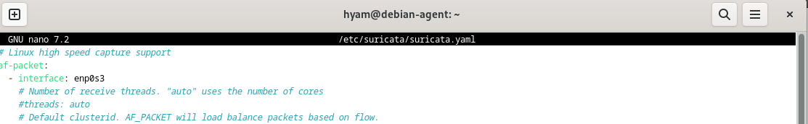
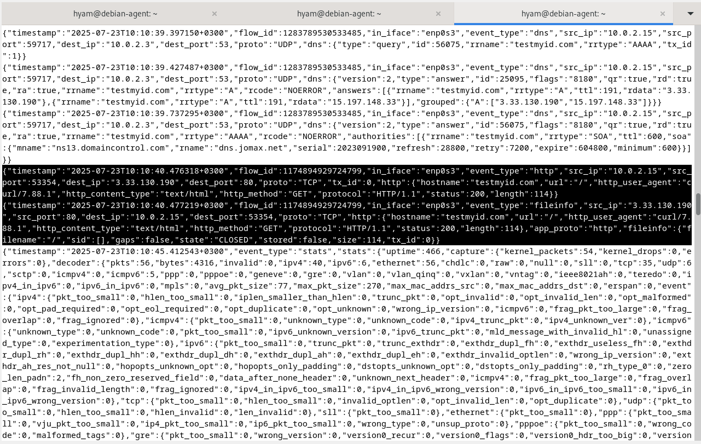
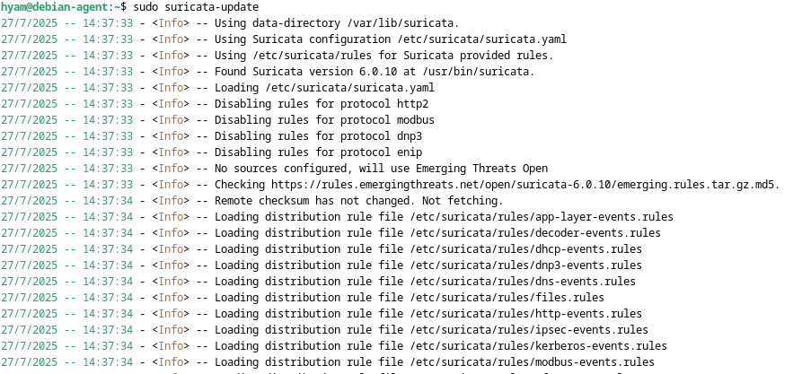
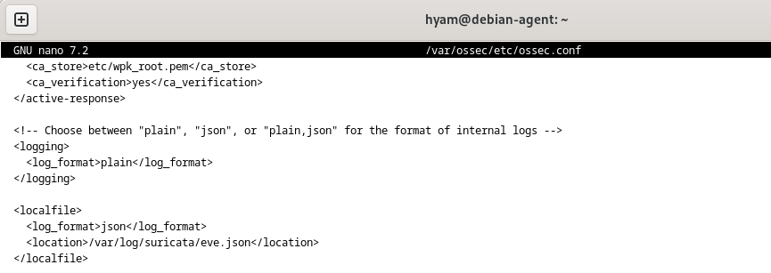
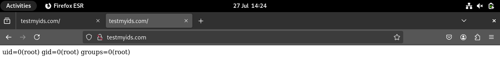
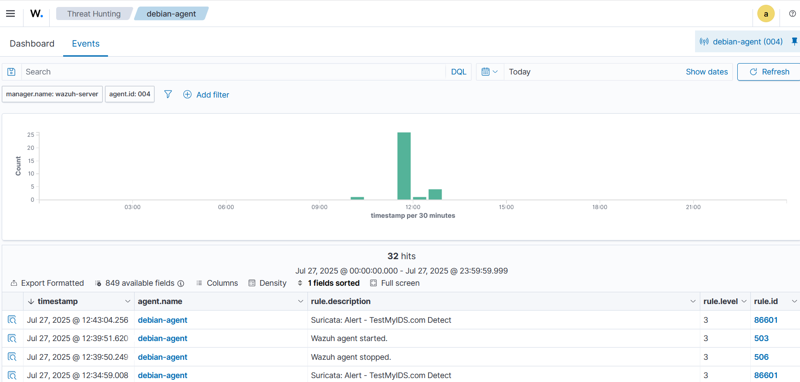
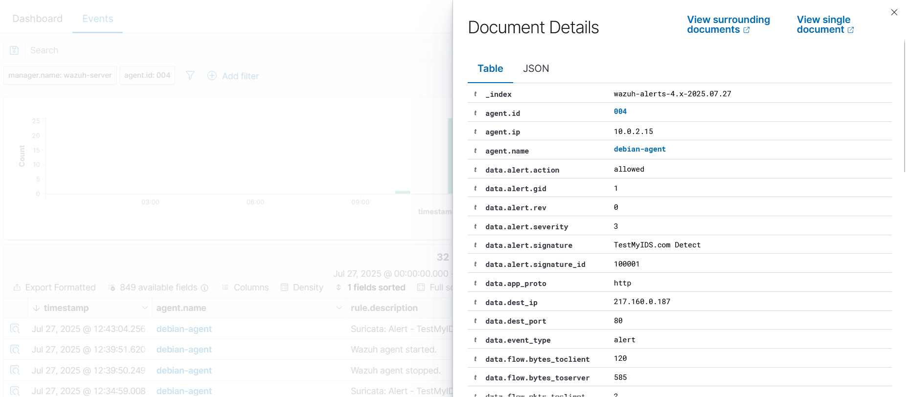

# Suricata IDS/IPS Integration with Wazuh

## Objective

Deploy Suricata on the Debian Wazuh Agent, configure network traffic monitoring and detection rules, integrate Suricata EVE JSON logs with Wazuh, and validate the integration through a controlled detection test.

## Phase Overview

This phase focused on extending the Wazuh monitoring environment with Suricata, an open-source IDS/IPS capable of inspecting network traffic and generating security events.

The implementation covered the following areas:

- Suricata deployment on the Debian Agent.
- Network interface configuration.
- Emerging Threats (ET) Open ruleset update.
- Suricata event logging through EVE JSON.
- Integration of Suricata logs with the Wazuh Agent.
- Custom detection rule configuration.
- End-to-end detection validation through Wazuh.

## Environment

| Component | Role |
|----------|------|
| Debian Virtual Machine | Hosted the Suricata sensor and Wazuh Agent. |
| Suricata | Monitored network traffic and generated IDS alerts. |
| Wazuh Agent | Collected Suricata EVE JSON events. |
| Wazuh Manager | Processed events received from the agent. |
| Wazuh Dashboard | Displayed and analyzed the resulting security alerts. |

## 1. Deploy Suricata IDS/IPS

### Overview

Suricata was installed on the Debian Wazuh Agent to monitor network traffic and detect potential security events.

The Suricata service was enabled and started after installation. Its status was then verified to confirm that the sensor was running correctly.

### Network Interface Configuration

Suricata was configured to monitor the Debian system's active network interface:

`enp0s3`

The monitoring interface was configured in:

`/etc/suricata/suricata.yaml`

### Traffic Monitoring Verification

Suricata's EVE JSON output was monitored to confirm that network events were being captured:

`/var/log/suricata/eve.json`

The generated events provided the data used later for integration with Wazuh.

## 2. Configure Emerging Threats (ET) Open Ruleset

### Overview

The Emerging Threats (ET) Open ruleset was updated using `suricata-update` to provide current detection rules for network security monitoring.

The ruleset was updated and verified to ensure that the rules loaded successfully without errors.

### Custom Detection Rule

In addition to the ET Open ruleset, a local detection rule was configured to detect traffic associated with TestMyIDS.com.

The custom rule was configured in:

`/etc/suricata/rules/local.rules`

The rule used the following detection logic:

```text
alert http any any -> any any (msg:"TestMyIDS.com Detect"; content:"testmyids.com"; nocase; sid:100001; rev:1;)
````

After the rule was added, Suricata was restarted to apply the configuration.

## 3. Integrate Suricata with Wazuh

### Overview

The Wazuh Agent was configured to collect Suricata EVE JSON logs.

The Suricata log source configured for collection was:

`/var/log/suricata/eve.json`

The Wazuh Agent configuration was updated through:

`/var/ossec/etc/ossec.conf`

After the configuration change, the Wazuh Agent was restarted so the new log collection settings could take effect.

### Integration Verification

The integration was verified by confirming that Suricata logs and alerts were being received and displayed in the Wazuh Dashboard.

This established the following event flow:

**Network Traffic → Suricata → EVE JSON → Wazuh Agent → Wazuh Manager → Wazuh Dashboard**

## 4. Validate and Tune the Integration

### Detection Test

A controlled detection test was performed by accessing TestMyIDS.com from Firefox.

The request was used to trigger the custom Suricata detection rule.

Suricata generated an alert event in `eve.json` with:

* `event_type: alert`
* Signature: `TestMyIDS.com Detect`

### Wazuh Alert Verification

The generated Suricata event was successfully ingested by Wazuh and displayed in the Wazuh Dashboard.

The resulting alert contained:

| Item      | Details                |
| --------- | ---------------------- |
| Signature | `TestMyIDS.com Detect` |
| Level     | `3`                    |
| Groups    | `IDS, Suricata`        |

This confirmed successful end-to-end communication between Suricata and Wazuh.

## Evidence

### Suricata Service Status

The Suricata service was verified as active and running.



### Network Interface Configuration

Suricata was configured to monitor the `enp0s3` network interface.



### Suricata Traffic Monitoring

EVE JSON output was monitored to verify that Suricata was capturing network events.



### ET Open Ruleset

The ET Open ruleset was updated and verified during the Suricata configuration process.



### Suricata to Wazuh Integration

The Wazuh Agent was configured to collect Suricata EVE JSON logs.



### Suricata Detection Test

The controlled TestMyIDS.com request triggered the custom Suricata detection rule.



### Suricata Logs in Wazuh Dashboard

Suricata logs and alerts were successfully received and displayed in the Wazuh Dashboard.



### Final Wazuh Alert

The Suricata alert was successfully processed by Wazuh and displayed with the expected signature, severity level, and alert groups.



## Challenges Faced

### Alert Visibility Issue

Suricata generated alerts in `eve.json`, but the events were initially not visible in the Wazuh Dashboard.

The Wazuh Agent configuration was reviewed and corrected, followed by an agent restart. The Suricata alerts were then successfully ingested by Wazuh.

### Suricata Service Issues

Service-related issues were encountered, including PID file errors and an invalid `suricata:suricata` service user configuration.

The service configuration and permissions were corrected, after which the Suricata service was verified using `systemctl`.

### Interface Configuration Issue

Suricata initially failed to capture the expected network traffic because the incorrect network interface was configured.

The configuration was updated to use `enp0s3`, and Suricata was restarted.

### Ruleset Update Issue

The `suricata-update` process temporarily appeared to freeze during the `"Backing up suricata.rules"` stage.

The process was monitored and allowed to complete, with the update subsequently verified.

## Achieved Results

* Successfully deployed Suricata on the Debian Wazuh Agent.
* Configured Suricata to monitor the `enp0s3` network interface.
* Updated and validated the ET Open ruleset.
* Configured a custom Suricata detection rule.
* Verified Suricata event generation through EVE JSON.
* Integrated Suricata EVE JSON logs with the Wazuh Agent.
* Confirmed that Suricata alerts were displayed in the Wazuh Dashboard.
* Successfully performed an end-to-end detection test using TestMyIDS.com.

## Lessons Learned

* Gained practical experience deploying and configuring an IDS within an existing Wazuh monitoring environment.
* Learned how Suricata generates structured security events through EVE JSON.
* Learned how Wazuh Agents can collect and forward Suricata events for centralized monitoring.
* Improved troubleshooting skills by resolving service, interface, ruleset, and log ingestion issues.
* Gained experience creating and validating a custom network detection rule.
* Developed a clearer understanding of the end-to-end flow from network activity to SIEM alert generation.


