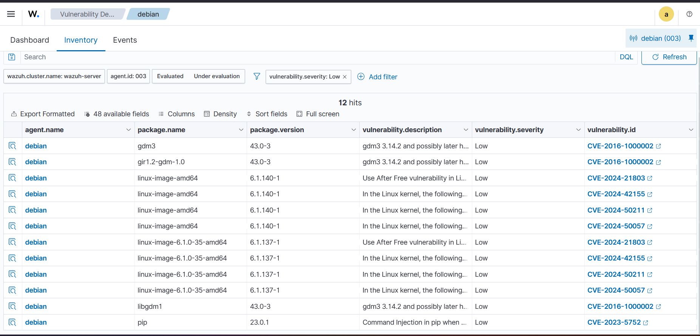
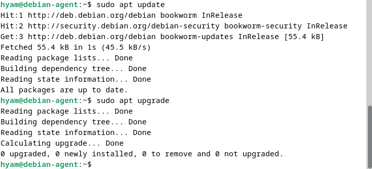
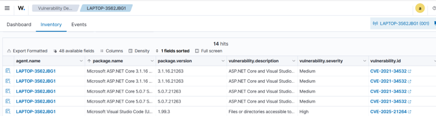
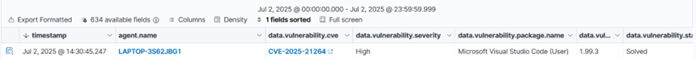

# Vulnerability Detection

## Objective

Identify software vulnerabilities reported by Wazuh, understand their severity and affected software versions, apply appropriate remediation actions, and verify the results through the Wazuh Vulnerabilities module.

## Software Used

| Software                | Purpose                                                                          |
| ----------------------- | -------------------------------------------------------------------------------- |
| Wazuh Dashboard         | Reviewed detected vulnerabilities, severity levels, CVEs, and affected software. |
| Debian Virtual Machine  | Tested vulnerability detection and package updates on Linux.                     |
| Windows Virtual Machine | Tested vulnerability detection and software patching on Windows.                 |
| APT Package Manager     | Updated Debian packages to address available software updates.                   |
| Visual Studio Code      | Software identified with a high-severity vulnerability on Windows.               |

## Implementation

Vulnerability Detection was tested on both Debian Linux and Windows agents to understand how Wazuh identifies vulnerable software and reports associated CVEs and severity levels.

### Linux – Debian

Wazuh identified several low-severity vulnerabilities associated with installed Debian packages.

The Vulnerabilities module displayed affected packages, installed versions, CVE identifiers, severity levels, and vulnerability descriptions.

Examples of affected packages included:

* `gdm3`
* `gir1.2-gdm-1.0`
* `linux-image-amd64`
* `linux-image-6.1.0-35-amd64`
* `libgdm1`
* `pip`

The detected vulnerabilities were classified as **Low** severity in the Wazuh Dashboard.

### Remediation

The Debian system was updated using the APT package manager:

```bash
sudo apt update
sudo apt upgrade
```

The package manager completed the update process and reported that all packages were up to date.

### Windows – Visual Studio Code

Wazuh identified a **High** severity vulnerability affecting Microsoft Visual Studio Code (User), version **1.99.3**.

The vulnerability was associated with:

* **CVE:** `CVE-2025-21264`
* **Severity:** High
* **Affected Software:** Microsoft Visual Studio Code (User)
* **Affected Version:** 1.99.3

The vulnerability description indicated a security issue involving files or directories accessible to external parties that could allow an unauthorized local bypass.

### Remediation

Visual Studio Code was updated to a newer version using the official update mechanism or installer.

## Verification

The vulnerability results were reviewed through the Wazuh Vulnerabilities module.

### Linux Verification

The Debian system was updated using:

```bash
sudo apt update
sudo apt upgrade
```

The command output confirmed that the package update process completed successfully and that the system reported:

```text
0 upgraded, 0 newly installed, 0 to remove and 0 not upgraded.
```

The Wazuh Vulnerabilities module was then reviewed to observe the vulnerability state reported for the Debian agent.

### Windows Verification

After updating Visual Studio Code, the Wazuh Vulnerabilities module was reviewed to verify the status of the previously detected vulnerability.

The old vulnerable Visual Studio Code version was no longer reported after the software update, confirming that the remediation was successfully reflected in Wazuh.

## Evidence

### Linux – Detected Vulnerabilities

The Wazuh Vulnerabilities module identified multiple **Low** severity vulnerabilities affecting packages installed on the Debian agent.



### Linux – Package Update

The Debian system was updated using `apt update` and `apt upgrade`. The package manager confirmed that the system was up to date.



### Windows – Detected Visual Studio Code Vulnerability

Wazuh identified a **High** severity vulnerability, `CVE-2025-21264`, affecting Microsoft Visual Studio Code (User) version 1.99.3.



### Windows – Post-Remediation Verification

After updating Visual Studio Code, Wazuh no longer reported the old vulnerable version in the Vulnerabilities module.



## Lessons Learned

* Gained practical experience using Wazuh Vulnerability Detection across both Linux and Windows environments.
* Learned how Wazuh associates installed software versions with CVEs and severity levels.
* Practiced using the Linux package manager to apply available system updates.
* Gained experience identifying a specific vulnerable application on Windows and applying a software update as remediation.
* Learned that vulnerability results should be re-evaluated after remediation rather than assuming that an update immediately clears a finding.

وبعدها **Preview فقط، لا تسوين Commit**. لما تشوفينه في الـ Preview أرسلي لي صورة، وأنا أتأكد لك أن التنسيق والصور والمسارات كلها صحيحة قبل ما ننتقل للصور.
